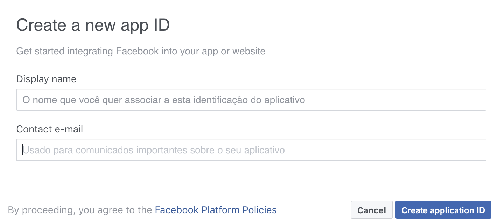
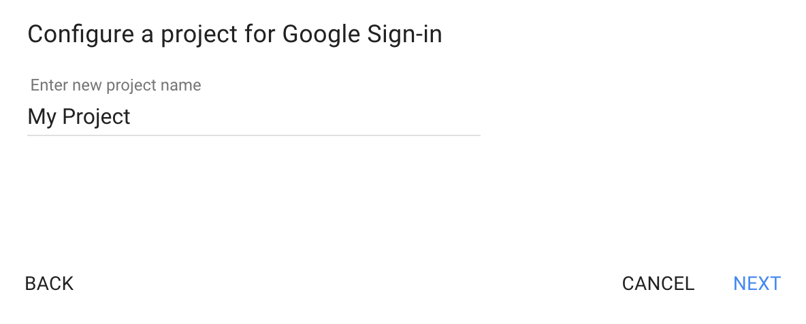
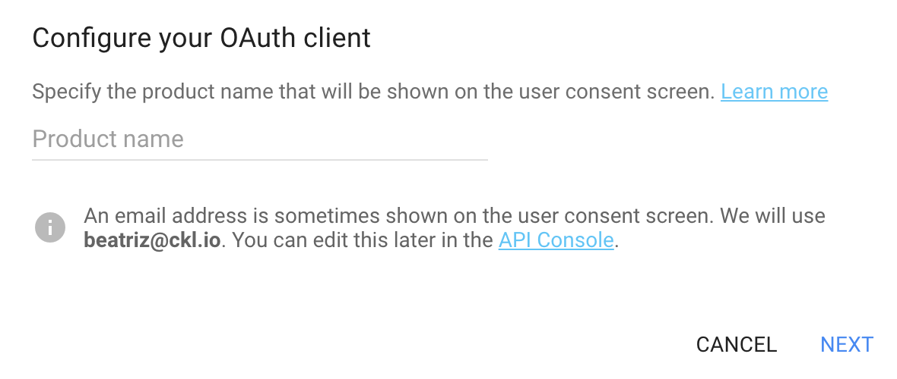
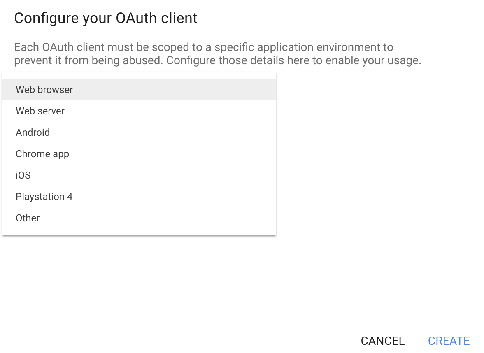
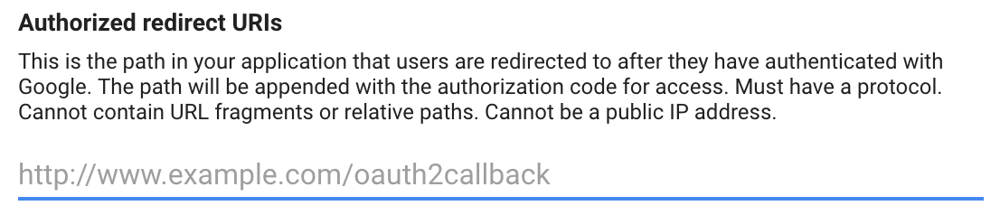

# react-next-boilerplate

Welcome to our React/Next boilerplate, we are really anxious to start a new app development using these technologies.
So we are inviting you to ride with us on this document to learn how to grow up your app scratching from here.

[Let's do it together!!!](https://www.youtube.com/watch?v=ZXsQAXx_ao0)

## Getting Started

### First step - Run the boilerplate

So, in the first moment you should clone this repo into your work dir:

```sh
$ git clone git@github.com:CheesecakeLabs/react-next-boilerplate.git
```

ok, now we have a copy of `react-next-boilerplate`, let's rename it:

```sh
$ mv react-next-boilerplate <project-name>
```

and go there...

```sh
$ cd <project-name>
```

Now, we are ready to serve our dev server, to do this, please run this command:
```sh
$ yarn dev
```

**Note:** if you don't have yarn installed go to this [link](https://yarnpkg.com/lang/en/docs/getting-started/) and follow the instructions.

Congratulations, your server is running on [http://localhost:5000](http://localhost:5000)!!!

The **first** step of our work is done.

### Second step - Configure the git

[WIP]

### Third sted - Replace files

[WIP]

### Social Login Setup

##Facebook Setup

Go to [Facebook developers](https://developers.facebook.com/apps/) and create an app and give a name to it 'ckl-oauth'.



Click on `create app identification` button 
Wait the page load then on left side menu click on `Basic` button then click on `Add Platform` section and finally select the `Site` option

Fill `Site URL` section with client url

After that on your left menu side click on `Products +` button -> choose `facebook login product` -> click on `Settings` and fill `Valid OAuth redirect URIs` input

**Don't forget to `save` all the changes

##Google Setup

Go to [Google developers](https://developers.google.com/identity/sign-in/web/sign-in) click on `configure a project` button



Then click on `continue` button



Then click on `continue` button



Fill the `Authorized redirect URIs` input




**You can always manage your API credentials and usage later in the [API Console](https://console.developers.google.com/apis/dashboard).


## How to...

[WIP]

## Articles

[WIP]

## How to Contribute

[WIP]

## License

[WIP]
